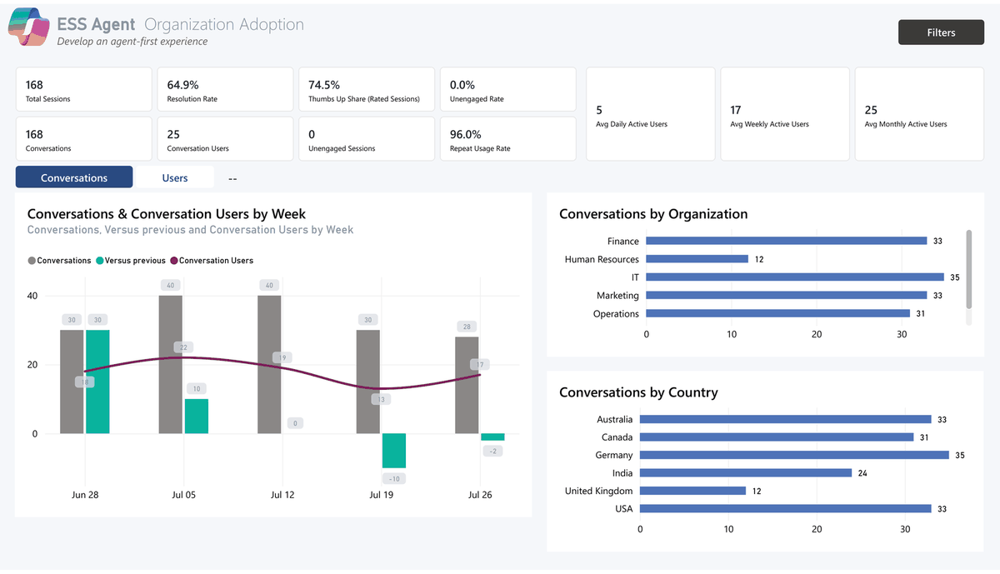

# ESS Insights — Employee Self-Service Agent Analytics

> **Measure the real-world impact of your Microsoft Employee Self-Service (ESS) Copilot Studio agent — adoption, outcomes, deflection, and user feedback — using only the data your agent already produces.**

A drop-in Power BI template purpose-built for the **Microsoft ESS agent**, with a 9-page executive dashboard that answers the questions HR, IT, and the executive sponsor will actually ask after launch.

> 📊 **Data source:** This report leverages the **`ConversationTranscript` Dataverse table** that Copilot Studio writes for every agent conversation. No custom logging, no extra pipelines — just the data your agent already produces.

> 💡 Built for ESS, but works for **any Copilot Studio agent** — the same template will load and analyze transcripts from any agent (HR, IT, sales enablement, custom). See [Customize for your agent](#customize-for-your-agent).

> 🎬 **New — ESS Insights Overview (video):** a quick video walkthrough of the dashboard's capabilities — the fastest way to see what it does before diving into setup.
>
> https://github.com/user-attachments/assets/efa683f8-edec-4a53-897b-8e02fc112f3f
>
> 📖 **New — [Interpretation Guide (PowerPoint)](ESS%20Insights%20Dashboard%20-%20Interpretation%20Guide.pptx):** a page-by-page walkthrough of every dashboard page — what each visual means and, more importantly, what to *do* with it. Numbered markers connect each chart to plain-language interpretation and a recommended next step.
>
> 📈 **Companion deck — [Topic to Time Savings](Topic%20to%20Time%20Savings.pptx):** shows how to translate topic-level conversation data into a defensible hours-saved and dollar-value estimate for the Business Impact page.

---

> ### 🚀 New here? Start in 3 steps
> **1.** [Pick your path (CSV or Dataverse)](#quick-start--choose-your-path) → **2.** [Get your data files](#get-your-data-files) → **3.** Open the `.pbit` and point it at your data.
>
> **Jump to:** [Choose your path](#quick-start--choose-your-path) · [Get your data files](#get-your-data-files) · [What you get](#what-you-get) · [Before you start](#before-you-start) · [Troubleshooting](#validation--troubleshooting) · [Full setup guides ↗](#quick-start--choose-your-path)

---

<strong>🆕 What's new in V17</strong>

- **New: Fabric Auto-Refresh path available** — for teams managing multiple Dataverse environments, needing refresh at very large scale, or wanting built-in Copilot credit-consumption analytics and automatic offline topic identification, see the **[ESS - Fabric V1 setup guide ↗](SETUP-Fabric.md)**. It's an additional option alongside CSV Upload and Dataverse Direct — most customers should keep using whichever of those two they're already on.

V17 is cumulative — it includes every improvement from the earlier 1.x, V5–V10 releases, including scheduled-refresh support, system-topic filtering, and all V10 fixes (adoption toggle filter preservation, verbatim feedback scrolling, per-agent cost/ROI accuracy, weekly user mix correction, expanded glossary, and more). Applies to both the CSV Upload and Dataverse Direct editions.

---

## Why use this template for your ESS agent

<strong>Click to expand</strong>

The Microsoft ESS agent gives your employees a single, conversational front door to HR, IT, payroll, benefits, and travel self-service. But the platform gives you *nested data*, not insights. This template answers the questions an ESS program owner needs to answer every month:

- **Are employees adopting it?** Distinct users, repeat usage, DAU/WAU/MAU trend
- **Is it actually resolving their requests?** Resolution vs. escalation vs. abandonment rates, by topic
- **How fast does it answer?** Avg duration, response time, turns to resolve
- **What is it saving the business?** Tickets deflected, hours saved, dollar value, credit cost
- **Are employees happy with it?** In-conversation thumbs, CSAT, verbatim comments
- **Which intents need authoring help?** Per-topic deflection, abandonment, and outcomes

All nine pages light up from a single Power Platform export. Add optional companion files to unlock organization/country breakouts, satisfaction scores, and credit cost analysis.

---

## What you get

<strong>Click to expand — 9-page dashboard overview</strong>

| # | Page | What it answers |
|---|---|---|
| 1 | **Executive Summary** | Top-line scorecard for the sponsor — adoption, business outcomes, operational KPIs, productivity, and quality (and the value they create over time) at a glance |
| 2 | **Conversation Outcomes** | Resolution / escalation / abandonment trend, topic outcomes, top deflected topics |
| 3 | **Adoption** | Volume, distinct users, repeat-usage rate, DAU/WAU/MAU, breakdown by Org & Country |
| 4 | **Time to Knowledge** | Avg duration, response time, turns to resolve, abandonment & unengaged rate |
| 5 | **Conversation Details** | Per-topic drill-through with full transcripts and a first-message word cloud |
| 6 | **Business Impact** | Tickets deflected, hours saved, $ saved, credit-consumption leaderboard |
| 7 | **Improvement Opportunities** | Which intents need authoring help — per-topic deflection, abandonment, and the training backlog to prioritize |
| 8 | **Agent Feedback** | In-conversation thumbs, CSAT, verbatim comments, satisfaction trend |
| 9 | **📖 Glossary** | Every metric defined, calculated, and sourced — no black boxes |

*(A hidden **Alternate Executive Summary** page is retained in the file as an optional layout — not shown in the published report.)*

---

## Before you start

Quick checklist — confirm all four before your working session. Click each item for details.

- [ ] **Power BI Desktop installed** (Windows) — [details ↓](#1-power-bi-desktop-installed)
- [ ] **Bot Transcript Viewer** role assigned (minimum) on the agent's Dataverse environment — [details ↓](#data-inputs)
- [ ] **Agent environment is Production, Sandbox, or Default** *(not Teams or M365 Copilot)* — [details ↓](#2-supported-environment-types)
- [ ] **Agent configured to capture transcripts + node-level details** — [details ↓](#3-agent-configuration)

> 💡 If you're extending the default 30-day Dataverse history window, that has to be done **before** the data you want exists. See [Dataverse retention window ↓](#4-dataverse-retention-window).

---

## Prerequisites — details

<strong>Click to expand — full prerequisites reference</strong>

### 1. Power BI Desktop installed

- **Required.** The `.pbit` template opens in Power BI Desktop on **Windows only**. Mac users need a Windows VM or Parallels.
- **Download:** [Download PowerBI for free](https://www.microsoft.com/en-us/download/details.aspx?id=58494&msockid=2488193a4d40616c33750f9a4c3760f0)(Download PBI) (free) or install from the Microsoft Store.
- **Version:** Any release from the last 6 months. The template uses standard connectors only.

### 2. Supported environment types

Copilot Studio agents can live in different environment types. **Only some of them persist transcripts to Dataverse** — which is what this dashboard reads.

| Environment type | Transcripts written to Dataverse? | Use with this dashboard? |
|---|---|---|
| **Production** | ✅ Yes | ✅ Yes |
| **Sandbox** | ✅ Yes | ✅ Yes |
| **Default** *(per-tenant)* | ✅ Yes | ✅ Yes |
| **Developer** *(per-user)* | ⚠️ Yes, but only your own conversations | ⚠️ Demo only — not multi-user analytics |
| **Microsoft Teams environment** | ❌ No — transcripts are not persisted | ❌ Not supported |
| **Microsoft 365 Copilot environment** | ❌ No | ❌ Not supported |

**How to check your environment type:**
1. Power Platform Admin Center → **Environments** → click the env hosting the agent.
2. The **Type** column (or the env detail page) shows Production / Sandbox / Default / Developer / Teams.
3. If it's Teams or M365 Copilot, the agent needs to be **moved or republished** to a Production or Sandbox env to enable transcript analytics.

### 3. Agent configuration

These toggles control **what** gets written to the transcript. With them off, transcripts are still saved, but most dashboard metrics will look blank.

#### a) Enable conversation transcripts

1. Open the agent in [Copilot Studio](https://copilotstudio.microsoft.com).
2. **Settings** (top right) → **Advanced** → **Conversation transcripts**.
3. Confirm **"Save conversation transcripts to Dataverse"** is **ON**.
4. **Save / publish** the agent.

#### b) Include node-level details *(critical for this dashboard)*

1. Same Settings page → scroll to **Enhance Transcripts**.
2. Turn **"Include node-level details in transcripts"** **ON**.
3. **Save / publish** the agent.

> Without this, the dashboard's topic detection, turn counts, durations, and outcome classification will all be blank.

#### c) Don't conceal user names *(only matters if you want per-user analytics)*

1. Microsoft 365 Admin Center → **Settings** → **Org settings** → **Reports**.
2. **Uncheck** "Display concealed user names in all reports."
3. Otherwise UPNs in transcripts come back as anonymized hashes and Org Data joins will fail.

> ⏱ **Important:** These settings only affect **future** conversations. Historical transcripts written while a toggle was off won't backfill. Run a few test conversations after enabling them, wait 2–5 minutes, then refresh the dashboard.

### 4. Dataverse retention window

By default, Dataverse **automatically deletes conversation transcripts after 30 days** via a system bulk-deletion job. If you want a longer history window:

**Option A — Extend retention via the Copilot Studio agent setting**
1. Copilot Studio → agent → **Settings** → **Advanced** → **Conversation transcripts**.
2. Set **"Number of days to retain transcripts"** to the desired value (max varies by tenant; commonly up to 365).
3. **Save / publish**.

**Option B — Modify the Dataverse bulk-delete job** *(requires System Administrator)*
1. Power Platform Admin Center → **Environments** → click the env → **Settings** → **Data management** → **Bulk record deletion**.
2. Find the recurring job named something like **"Bulk delete conversation transcripts older than 30 days"**.
3. **Edit** → change the date filter (e.g. `older than 90 days`) or **deactivate** the job.
4. **Save**.

> 💡 **Plan ahead.** If a customer wants 12 months of trend in the dashboard, retention must already have been extended **12 months ago**. You can't backfill deleted transcripts.

📖 **Learn more:** [Manage conversation transcript retention — Microsoft Learn](https://learn.microsoft.com/en-us/microsoft-copilot-studio/analytics-transcripts-powerapps)

---

## Quick start — choose your path

This dashboard ships in **two flavors**. Pick the one that matches how you want to refresh your data:

| | 📄 **CSV Upload** | 🔌 **Dataverse Direct** |
|---|---|---|
| **How it loads data** | You export `ConversationTranscript` to CSV, then point the template at the file | The template connects live to your Dataverse environment via the native Power BI connector |
| **Setup time** | ~10 min | ~5 min |
| **Refresh** | Re-export the CSV, drop it at the same path, click Refresh | One click — pulls live from Dataverse |
| **Power BI Service refresh** | **No Gateway** if the CSV is hosted on SharePoint/OneDrive; local/network paths need a Gateway | **No Gateway** — cloud-to-cloud |
| **Who can run it** | Anyone who can run the Dataverse export | Anyone with the **Bot Transcript Viewer** role on the environment |
| **Lookback control** | Whatever the export window allows (default 30 days) | Parameter — pull 30 / 90 / 365 days at will |
| **Best for** | One-off snapshots, demos, sharing with people outside the tenant | Production dashboards, scheduled refresh, ongoing monitoring |
| **Get the template** | [`ESS Dashboard - Dynamic Topics (CSV) V17.pbit`](./ESS%20Dashboard%20-%20Dynamic%20Topics%20(CSV)%20V17.pbit) | [`ESS Dashboard - Dynamic Topics (Dataverse) V17.pbit`](./ESS%20Dashboard%20-%20Dynamic%20Topics%20(Dataverse)%20V17.pbit) |
| **Setup guide** | 📘 **[Written Setup Guide — CSV Upload](./SETUP-CSV-Download.md)** | 📘 **[Written Setup Guide — Dataverse Direct](./SETUP-Dataverse.md)** |

> 💡 **Not sure?** If this is your first time exploring the dashboard, start with **CSV Upload** — no tenant permissions needed beyond running the Dataverse export. Move to **Dataverse Direct** once you're ready to put the dashboard in front of stakeholders on a schedule.

> 🔄 **Want it to update itself?** See **[Set up automatic (scheduled) refresh ↗](AUTO-REFRESH.md)** — gateway‑free for Dataverse Direct and for SharePoint/OneDrive‑hosted CSVs.

### 🧱 Need more than CSV or Dataverse Direct? — Fabric Auto-Refresh (add-on)

Not a third default choice — an optional add-on for teams that have outgrown the two paths above. Use it only if: you're consolidating **multiple Dataverse environments** into one dashboard, you're hitting **refresh limits at very large scale**, or you want **built-in Copilot credit-consumption analytics** and automatic offline topic identification.

| | 🧱 **Fabric Auto-Refresh** |
|---|---|
| **How it loads data** | Notebooks land conversation data into a Fabric Lakehouse; the template connects via the Lakehouse SQL endpoint or Direct Lake |
| **Setup time** | Meaningfully longer than either path above, first time through — realistically **30–60+ minutes of hands-on work**: create/configure the Fabric workspace and Lakehouse (a trial capacity is enough to evaluate), import and configure the two notebooks, and run the initial ingestion. Add more time if you also need to provision the Entra app registration the live pull uses (see **Who can run it** below). Re-running later is just re-running the notebooks — or fully automatic once scheduled |
| **Refresh** | Fully automatic once the notebooks are scheduled — no manual re-export or re-import |
| **Power BI Service refresh** | No traditional "Scheduled refresh" toggle in the same sense as the other two paths. The template connects via the Lakehouse SQL analytics endpoint (Import/DirectQuery — schedule a refresh against that endpoint, cloud-to-cloud, no Gateway) or Direct Lake (no import step at all; it syncs automatically as the Lakehouse's Delta tables change). Either way, how current the numbers are depends on how often the two ingestion notebooks are run or scheduled — not on the report's own refresh setting |
| **Who can run it** | A higher bar than the other two paths: Fabric workspace access with permission to create/run notebooks and create a Lakehouse, **plus** — for the live Dataverse pull this path is built around — an Entra app registration added as a Dataverse **Application User** with Read access on Conversation Transcript in every environment being ingested. Setting that up typically needs an Entra or Dataverse admin, not just the report owner |
| **Lookback control** | A `LOOKBACK_DAYS` parameter in the transcript-parser notebook's config cell (default `7` days; `0` = full history on `conversationstarttime`). It's one shared value per notebook run, applied to every Dataverse environment configured in that run — not a distinct value per environment within a single run, though the config cell is built for a pipeline to override it, so different environments can get different windows by running the notebook once per environment |
| **Best for** | Consolidating **multiple Dataverse environments** into one dashboard, refresh performance at **very large scale** where live Dataverse queries run slow or time out, or wanting **built-in Copilot credit-consumption analytics** and automatic topic identification without a manual export every cycle |
| **Get the template** | [`ESS - Fabric V1.pbit`](./ESS%20-%20Fabric%20V1.pbit) |
| **Setup guide** | 📘 **[Written Setup Guide — Fabric](./SETUP-Fabric.md)** |

> Most customers should keep using CSV Upload or Dataverse Direct above. See **[SETUP-Fabric.md](./SETUP-Fabric.md)** for the full "is this path right for you?" checklist before starting.

---

## Get your data files

**This is the part most people ask about: where do I actually go to get each file?** Below is the exact click-path for every input, and which template needs it. Each row links to the full step-by-step (with every menu spelled out) in the setup guide for your path.

> 📌 **The only difference between the two templates:** the **CSV Upload** template needs a **transcript CSV** you export yourself; the **Dataverse Direct** template pulls transcripts **live** and only needs your **environment URL**. Org Data and Agent Credits are the same optional files for both.

### 📄 CSV Upload — get these files

| # | File | Required? | Where to get it — exact path | Full steps |
|---|---|---|---|---|
| 1 | **Conversation Transcripts** | ✅ **Required** | [make.powerapps.com](https://make.powerapps.com) → switch to your agent's environment (top-right selector) → **Tables** → **All** → search `conversation` → open **ConversationTranscript** → **Export ▸ Export data** → **Download exported data** → unzip the CSV | [📘 CSV guide — Step 1](./SETUP-CSV-Download.md) |
| 2 | **Org Data** (HR roster) | ⭐ Recommended | [admin.microsoft.com](https://admin.microsoft.com) → **Users ▸ Active users ▸ Export users ▸ Confirm** — *or* export a roster CSV from your HR system | [📘 CSV guide — Step 2](./SETUP-CSV-Download.md) |
| 3 | **Agent Credits** | Optional | [copilotstudio.microsoft.com](https://copilotstudio.microsoft.com) → open your agent → **Analytics ▸ Message Consumption** → set date range → **Export** | [📘 CSV guide — Step 3](./SETUP-CSV-Download.md) |

> ⚠️ **Do not open the transcript CSV in Excel** — Excel corrupts the JSON in the `Content` column and the template fails to load with an `M Engine error`. Load it straight into Power BI.

### 🔌 Dataverse Direct — get these inputs

| # | Input | Required? | Where to get it — exact path | Full steps |
|---|---|---|---|---|
| 1 | **Dataverse Environment URL** *(no file — pulls transcripts live)* | ✅ **Required** | [make.powerapps.com](https://make.powerapps.com) → switch to your agent's environment → **⚙️ (gear) ▸ Session details** → copy **Instance url** (e.g. `https://orgabc12345.crm.dynamics.com`) | [📘 Dataverse guide — Step 1](./SETUP-Dataverse.md) |
| 2 | **Org Data** (HR roster) | ⭐ Recommended | [admin.microsoft.com](https://admin.microsoft.com) → **Users ▸ Active users ▸ Export users ▸ Confirm** | [📘 Dataverse guide — Step 2](./SETUP-Dataverse.md) |
| 3 | **Agent Credits** | Optional | [copilotstudio.microsoft.com](https://copilotstudio.microsoft.com) → open your agent → **Analytics ▸ Message Consumption** → **Export** | [📘 Dataverse guide — Step 3](./SETUP-Dataverse.md) |

### 🧱 Fabric Auto-Refresh — get these files

> 💡 **New to Fabric?** A **Fabric workspace** is just a project folder in the Power BI/Fabric service. A **Lakehouse** is a storage location inside that workspace where the notebooks below will save your conversation data. A **notebook** is a small, pre-written program — you don't need to know how to code to run it, just how to click "Run all cells."

| # | File | Required? | Where to get it | Full steps |
|---|---|---|---|---|
| 1 | **`ESS - Fabric V1.pbit`** (the dashboard template) | ✅ **Required** | Download from this repo's root folder | [📘 Fabric guide — Step 1](./SETUP-Fabric.md) |
| 2 | **`Copilot_Agent_Transcript_Parser.ipynb`** (notebook — parses conversation transcripts) | ✅ **Required** | Download from [`Fabric/notebooks/`](./Fabric/notebooks/) in this repo | [📘 Fabric guide — Step 1](./SETUP-Fabric.md) |
| 3 | **`Copilot_Credit_Consumption_Ingester.ipynb`** (notebook — ingests Copilot credit usage) | Optional | Download from [`Fabric/notebooks/`](./Fabric/notebooks/) in this repo | [📘 Fabric guide — Step 1](./SETUP-Fabric.md) |
| 4 | **A Fabric workspace with a Lakehouse** | ✅ **Required** | Create one in the [Microsoft Fabric portal](https://app.fabric.microsoft.com/) — a trial capacity is enough to evaluate | [📘 Fabric guide — Before you start](./SETUP-Fabric.md#before-you-start) |

> ⚠️ **This path is more involved than CSV Upload or Dataverse Direct** — it requires access to a Fabric workspace and running two notebooks (a one-time setup, then optionally scheduled to repeat automatically). If you're not sure you need this, see [Is this path right for you?](./SETUP-Fabric.md#is-this-path-right-for-you) before starting.

**Next:** download the matching `.pbit` from [Choose your path](#quick-start--choose-your-path) above, open it in Power BI Desktop, and paste your file paths (or environment URL) into the parameter prompt.
→ **[Full CSV setup guide](./SETUP-CSV-Download.md)** · **[Full Dataverse setup guide](./SETUP-Dataverse.md)** · **[Full Fabric setup guide](./SETUP-Fabric.md)**

> 🔑 **Can't find the ConversationTranscript table, or transcripts come back empty?** You're almost certainly missing the **Bot Transcript Viewer** security role (Environment Maker is *not* enough), or your agent runs in an unsupported environment (Teams / M365 Copilot). See [Before you start](#before-you-start) and [Prerequisites — details](#prerequisites--details).

---

## Data inputs

<strong>Click to expand — required & optional files, roles, and what each unlocks</strong>

| File | Required? | Required role(s) | Unlocks |
|---|---|---|---|
| **Conversation Transcripts** (Dataverse export from your ESS environment) | ✅ Required | **Bot Transcript Viewer** (minimum, least-privilege) — or any role with Read on the `conversationtranscript` table. **System Administrator** always works. **System Customizer** usually works but isn't guaranteed; assign Bot Transcript Viewer alongside it to be safe. | All adoption, outcomes, time-to-knowledge, and in-conversation thumbs/CSAT feedback |
| **Org Data** (HR roster CSV: UPN, Department, JobTitle, Country) | ⭐ Recommended | **Global Reader**, **User Administrator**, or **Global Administrator** (Microsoft 365 Admin Center) | "Users by Organization" and "Users by Country" breakouts on every page |
| **Agent Credits** (Copilot Studio usage export) | Optional | **Copilot Studio Administrator** for the agent's environment | Credit consumption leaderboard and Business Impact page |

> ⚠️ **`Environment Maker` alone is not enough** to read transcripts. Customers often have this role and assume they're covered — they aren't. Grant **Bot Transcript Viewer** (or higher) explicitly.

> 💡 Roles are assigned in **Power Platform Admin Center → Environment → Settings → Users + permissions → Security roles** (Dataverse / Copilot Studio roles) or **Microsoft 365 Admin Center → Roles** (M365 roles). Extending Dataverse retention (see [Prerequisites §4](#4-dataverse-retention-window)) requires **System Administrator** on the environment.

> The template **will load and render every page without errors** even if you provide only the required transcripts file. Optional pages and breakouts will show blank where data is missing — by design, so you can start with the minimum and add more later.

---

## Validation & troubleshooting

<strong>Click to expand — common issues and fixes</strong>

| Symptom | Likely cause | Fix |
|---|---|---|
| "M Engine error: Token Identifier expected" on open | CSV opened in Excel before loading; Excel corrupted the JSON columns | Re-export from Dataverse, do **not** open in Excel, load directly into Power BI |
| Total Users count looks wrong | Same employee appears under both UPN and Entra Object ID in your transcripts | This is handled automatically — both identities are cross-walked in the model |
| "Users by Organization" chart shows only (Blank) | Org Data file not loaded, or UPN format doesn't match | Set the **Org Data File** parameter (Transform data → Edit Parameters); ensure the column is named `UserPrincipalName` |
| "Users by Country" chart shows "Something's wrong with one or more fields" | Your Org Data CSV is missing the Country column | Add a `Country` column to your Org Data file (it can be empty), or re-download the latest template |
| Repeat-usage rate is 0% | Period is too short (everyone is a first-time user) | Widen the date filter, or wait for more data |

Full validation checklist: see the **Validate before sharing** step in either setup guide ([CSV Upload](./SETUP-CSV-Download.md#step-6--validate-before-sharing) &middot; [Dataverse Direct](./SETUP-Dataverse.md#step-7--validate-before-sharing)).

---

## Customize for your agent

<strong>Click to expand — repurpose this template for any Copilot Studio agent</strong>

While this template is purpose-built for the Microsoft ESS agent, the underlying data model works against **any Copilot Studio agent's transcripts**. To use it for a different agent (HR-only, IT helpdesk, sales enablement, custom internal agent):

1. Point the **Transcript File** parameter at that agent's Dataverse export.
2. Open the **Adoption** page → click the title text box → replace "ESS Agent" with your agent name.
3. (Optional) Open the **Glossary** page → update the "About this report" callout.
4. Save as a new `.pbit` and re-distribute to your stakeholders.

No semantic-model edits required.

---

## Distribute to your stakeholders

<strong>Click to expand</strong>

- **Publish to Power BI Service** for a live, refreshable workspace report.
- **Export to PDF** for monthly executive updates.
- **Pin individual visuals** to a Teams dashboard for daily monitoring.

---

## Storytelling tips

<strong>Click to expand — how to present these numbers to execs</strong>

When presenting these numbers to a non-technical audience:

- **Lead with Business Impact, not Adoption.** Hours saved and tickets deflected resonate more than DAU with an exec sponsor.
- **Pair Outcomes with Topic Outcomes.** A 79% engagement rate means nothing without knowing *which* topics drove it.
- **Use Verbatim Feedback as proof.** Two quotes from real employees beats a 4.1/5 CSAT score every time.
- **Show the trend, not the snapshot.** The weekly trend visuals are your story arc — start there.

---

## Contributing & feedback

Found a bug? Have a feature request? [Open an issue](https://github.com/microsoft/ESS/issues) — feedback from real ESS customers makes this template better for everyone.

---

## License

[MIT](./LICENSE) — use it, modify it, ship it, share it.
