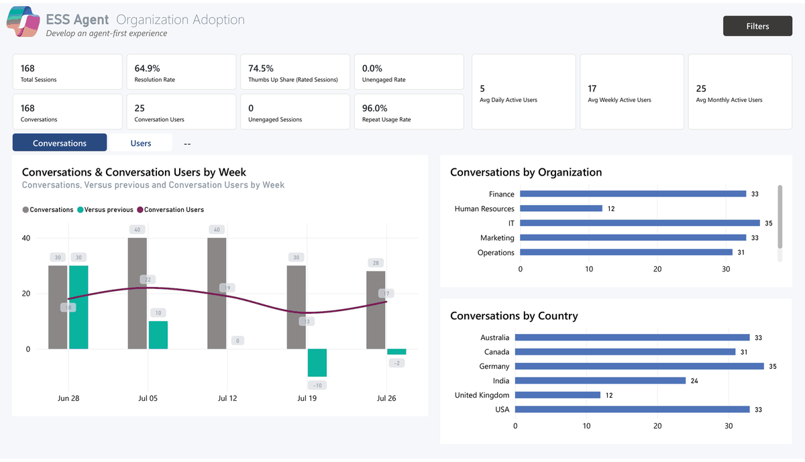

# ESS Insights — Employee Self-Service Agent Analytics

> **Measure the real-world impact of your Microsoft Employee Self-Service (ESS) Copilot Studio agent — adoption, outcomes, deflection, and user feedback — using only the data your agent already produces.**

A drop-in Power BI template purpose-built for the **Microsoft ESS agent**, with a 9-page executive dashboard that answers the questions HR, IT, and the executive sponsor will actually ask after launch.

> 📊 **Primary data source:** This report leverages the **`ConversationTranscript` Dataverse table** that Copilot Studio writes for supported agent channels. Microsoft 365 Copilot Chat reactions require the optional [cross-channel feedback export path](FEEDBACK-INGESTION.md), because Microsoft Copilot agents don't write Dataverse conversation transcripts.

> 💡 Built for ESS, but works for **any Copilot Studio agent** — the same template will load and analyze transcripts from any agent (HR, IT, sales enablement, custom). See [Customize for your agent](#customize-for-your-agent).

> 🎬 **New — ESS Insights Overview (video):** a quick video walkthrough of the dashboard's capabilities — the fastest way to see what it does before diving into setup.
>
> https://github.com/user-attachments/assets/efa683f8-edec-4a53-897b-8e02fc112f3f
>
> 📖 **New — [Interpretation Guide (PowerPoint)](ESS%20Insights%20Dashboard%20-%20Interpretation%20Guide.pptx):** a page-by-page walkthrough of every dashboard page — what each visual means and, more importantly, what to *do* with it. Numbered markers connect each chart to plain-language interpretation and a recommended next step.
>
> 📈 **Companion deck — [Topic to Time Savings](Topic%20to%20Time%20Savings.pptx):** shows how to translate topic-level conversation data into a defensible hours-saved and dollar-value estimate for the Business Impact page.

---

> ### 🚀 New here? Start in 4 steps
> **1.** [Download all files](#download-the-complete-self-service-package) → **2.** [Choose your path](#choose-your-path) → **3.** Follow that path's setup guide → **4.** Build the required agent registry, open the matching `.pbit`, and validate the report.
>
> **Jump to:** [Download all files](#download-the-complete-self-service-package) · [Choose your path](#choose-your-path) · [Common prerequisites](#common-prerequisites) · [Get your data](#get-your-data-files) · [Troubleshooting](#validation--troubleshooting)

---

## Download the complete self-service package

[**Download ESS Insights as a ZIP**](https://github.com/microsoft/ESS/archive/refs/heads/main.zip), select **Extract All**, and open the extracted `ESS-main` folder. Keep the folder structure intact.

| Included content | Location |
|---|---|
| Power BI templates | Repository root (`*.pbit`) |
| Customer-run Python tools | `tools/` |
| Shared topic taxonomy | `taxonomy/` |
| Fabric notebooks | `Fabric/notebooks/` |
| Fabricated validation data | `SampleData/` |
| Setup and troubleshooting guides | Repository root (`*.md`) |

> Run every documented Python command from the extracted `ESS-main` folder. Do not download a Python entry-point file by itself: some tools import companion files or load repository-relative configuration.

### Which local tools do I run?

| Tool | When to use it | Customer output |
|---|---|---|
| [`tools/agent_registry.py`](AGENT-REGISTRY.md) | **Required** for every template path | Validated `agent-registry.json` for CSV/Dataverse, or validated registry CSV for Fabric |
| [`tools/ess_topic_tuner.py`](TOPIC-TUNER.md) | Optional, when native and built-in topics leave important conversations uncategorized | Reviewed customer topic overrides |
| [`tools/ess_feedback_normalizer.py`](FEEDBACK-INGESTION.md) | Optional, when loading Microsoft 365 Product Feedback or Monitor reaction exports | Agent-scoped feedback CSV/JSON plus an audit report |

All three tools run locally with Python 3.10 or later and require no package installation.

---

## Choose your path

All three paths use the same ESS reporting model and require an [agent registry](AGENT-REGISTRY.md). Choose how transcripts should reach the report and whether you need an independent historical store.

<table>
<tr>
<td width="33%" valign="top">

### 🟢 Evaluate or share a snapshot
**CSV Upload**

Best for a first evaluation, a one-time export, an offline copy, or sharing a controlled snapshot. You manually export `ConversationTranscript` again whenever you want newer data.

➡️ **[Start with CSV Upload](SETUP-CSV-Download.md)**

</td>
<td width="33%" valign="top">

### 🔵 Monitor one environment
**Dataverse Direct — recommended**

Best production default for one supported Dataverse environment. Power BI connects cloud-to-cloud and can refresh on a schedule without a gateway.

Extend Dataverse retention for the reporting period you need; report refresh does not archive deleted records.

➡️ **[Start with Dataverse Direct](SETUP-Dataverse.md)**

</td>
<td width="33%" valign="top">

### 🟣 Preserve or consolidate at scale
**Fabric Lakehouse — advanced**

Use when you need independently governed history, multiple Dataverse environments in one report, very large-scale ingestion, or Lakehouse-based credit analytics.

Fabric preserves only records ingested before Dataverse deletes them and requires more administration.

➡️ **[Start with Fabric Lakehouse](SETUP-Fabric.md)**

</td>
</tr>
</table>

> 🧪 **Just exploring?** Start with **CSV Upload** and the fabricated files in [`SampleData`](SampleData/). No customer data is required.

<strong>Compare all three paths</strong>

| | 🟢 **CSV Upload** | 🔵 **Dataverse Direct** | 🟣 **Fabric Lakehouse** |
|---|---|---|---|
| **Best for** | Evaluation, snapshots, demos, controlled sharing | Ongoing production reporting for one environment | Durable governed history, multiple environments, or very large scale |
| **How transcripts load** | Manual Dataverse CSV export | Native Power BI Dataverse connector | Scheduled notebook writes Delta tables |
| **Typical setup** | 20–30 minutes | 15–25 minutes | 30–60+ minutes plus administrator setup |
| **Refresh** | Replace the CSV and refresh | Schedule Power BI refresh | Schedule notebook ingestion, then semantic-model refresh |
| **Power BI gateway** | None for SharePoint/OneDrive; required for local or network paths | None | None for the Lakehouse SQL analytics endpoint |
| **Primary access** | Dataverse transcript read/export access | Bot Transcript Viewer | Fabric access plus a Dataverse application user |
| **Historical behavior** | Snapshot contains only records retained when exported | Queries only records still retained in Dataverse | Merge preserves records already ingested into Delta |
| **Template** | `ESS Dashboard - Dynamic Topics (CSV) V18.pbit` | `ESS Dashboard - Dynamic Topics (Dataverse) V19.pbit` | `ESS - Fabric V2.pbit` |

### After you choose

1. Follow the selected setup guide above.
2. Complete the required [agent registry](AGENT-REGISTRY.md) before loading customer data.
3. Add [private topic overrides](TOPIC-TUNER.md) only when native and built-in topics leave important conversations uncategorized.
4. Add [Microsoft 365 feedback](FEEDBACK-INGESTION.md) only when cross-channel reactions are needed.

---

<strong>🆕 What's new in CSV V18 / Dataverse V19</strong>

- **Safer multilingual topic classification** — native Copilot Studio topics remain authoritative. Conversations without a native topic use customer-neutral English, Spanish, and Chinese rules with word-boundary matching, scoring, exclusions, confidence, and ambiguity handling. This prevents partial-word collisions such as `tick` matching `ticket`.

- **Private customer overrides without template releases** — [`ess_topic_tuner.py`](tools/ess_topic_tuner.py) analyzes transcripts locally, emits privacy-reduced review files with no full prompts, and produces approved overrides that CSV, Dataverse, and Fabric consume directly. See the [Private topic tuner guide](TOPIC-TUNER.md).

- **Cross-channel reaction reporting** — transcript reactions and normalized Microsoft 365 Product Feedback or Copilot Studio Monitor exports now combine into one deduplicated feedback table with channel, source, agent, conversation-match status, and verdict. The [Microsoft 365 feedback guide](FEEDBACK-INGESTION.md) includes the exact admin-center export path, safe Agent ID setup, local preparation command, audit checks, and load steps for every template.

- **Safe multi-agent registry** — one customer-controlled mapping connects transcript, credit, and Microsoft 365 title IDs. `ESS Safe` is the default; `Selected Agents` and explicit `All Agents` modes extend the same templates to other Copilot Studio agents without blending unrelated feedback. See [Agent registry and reporting scope](AGENT-REGISTRY.md).

- **Parent and child agent attribution in every path** — connected-agent traces now populate conversation-level parent/child details in CSV, Dataverse, and Fabric. The Fix-It Queue shows the child agent, while Fabric also retains the event-grain invocation bridge. See [Parent and child agent attribution](CHILD-AGENT-ATTRIBUTION.md).

- **Fabric history and signal safety** — bounded Dataverse pulls now merge by default instead of overwriting older history. Fabric parses canonical `messageReaction` activities and preserves authoritative `SessionInfo` outcomes before using transparent fallback states.

- **Agent filtering on Improvement Opportunities** — the Dataverse Direct edition now includes an Agent slicer so multi-agent environments can isolate improvement opportunities for a single agent.

- **Validated Copilot Studio credits** — CSV V18 and Dataverse V19 now accept the 30-day **User-Level Credit Consumption** export from the [Power Platform admin center](https://admin.powerplatform.microsoft.com). Credits match ESS through `Agent Id`; organization attribution uses `User Email`.

- **Clear observed-versus-modeled labeling** — total and billable credits are observed Power Platform admin center values. Cost, cost per resolved conversation, net value, and ROI are modeled because the export provides no conversation or topic ID.

- **Fabric V2 decimal-credit support** — preserves fractional Copilot Credits and validates the three Power Platform admin center export schemas before writing the Lakehouse tables.

Dataverse Direct V19 and CSV Upload V18 are cumulative — both include every improvement from the earlier releases.

---

## Why use this template for your ESS agent

<strong>Click to expand</strong>

The Microsoft ESS agent gives your employees a single, conversational front door to HR, IT, payroll, benefits, and travel self-service. But the platform gives you *nested data*, not insights. This template answers the questions an ESS program owner needs to answer every month:

- **Are employees adopting it?** Distinct users, repeat usage, DAU/WAU/MAU trend
- **Is it actually resolving their requests?** Resolution vs. escalation vs. abandonment rates, by topic
- **How fast does it answer?** Avg duration, response time, turns to resolve
- **What is it saving the business?** Tickets deflected, hours saved, dollar value, credit cost
- **Are employees happy with it?** In-conversation thumbs, CSAT, verbatim comments
- **Which intents need authoring help?** Per-topic deflection, abandonment, and outcomes

All nine pages light up from the transcript source. Add optional companion files to unlock organization/country breakouts, Microsoft 365 Copilot Chat reactions, and credit cost analysis.

---

## What you get

<strong>Click to expand — 9-page dashboard overview</strong>

| # | Page | What it answers |
|---|---|---|
| 1 | **Executive Summary** | Top-line scorecard for the sponsor — adoption, business outcomes, operational KPIs, productivity, and quality (and the value they create over time) at a glance |
| 2 | **Conversation Outcomes** | Resolution / escalation / abandonment trend, topic outcomes, top deflected topics |
| 3 | **Adoption** | Volume, distinct users, repeat-usage rate, DAU/WAU/MAU, breakdown by Org & Country |
| 4 | **Time to Knowledge** | Avg duration, response time, turns to resolve, abandonment & unengaged rate |
| 5 | **Conversation Details** | Per-topic drill-through with full transcripts and a first-message word cloud |
| 6 | **Business Impact** | Tickets deflected, hours saved, $ saved, credit-consumption leaderboard |
| 7 | **Improvement Opportunities** | Which intents need authoring help — per-topic deflection, abandonment, child-agent attribution, and the training backlog to prioritize |
| 8 | **Agent Feedback** | In-conversation thumbs, CSAT, verbatim comments, satisfaction trend |
| 9 | **📖 Glossary** | Every metric defined, calculated, and sourced — no black boxes |

*(A hidden **Alternate Executive Summary** page is retained in the file as an optional layout — not shown in the published report.)*

---

## How topic classification works

The templates preserve the topic recorded by Copilot Studio whenever one exists. Only conversations without a native topic use the derived classifier.

- **CSV and Dataverse Direct:** apply the shared customer-neutral taxonomy in `taxonomy/topics-taxonomy.csv`. The classifier currently covers English, Spanish, and Chinese, matches complete words or phrases for whitespace languages, uses CJK-aware matching for Chinese, and sends ambiguous or low-signal prompts to **Other / Uncategorized**.
- **Fabric:** applies the same first-stage contract. It can then group enough remaining uncategorized prompts into clearly labeled **Auto-Discovered** candidates using local character n-grams.
- **Private by design:** classification runs locally in Power Query or inside the customer's Fabric workspace. Transcript text is not sent to an external service.
- **Auditable:** the model retains the matched terms, score, confidence, ambiguity flag, language, source, and classifier version for troubleshooting.
- **Extensible:** customers can add reviewed local rules without rebuilding the PBIT by following the [Private topic tuner guide](TOPIC-TUNER.md).

The built-in taxonomy is intentionally conservative. Auto-discovered Fabric labels are candidate themes, not authoritative business taxonomy, and should be reviewed before they are used for decisions.

---

## Common prerequisites

Confirm the common requirements below before following the guide for your selected path. Fabric has additional prerequisites in its own guide.

- [ ] **Power BI Desktop installed** (Windows) — [details ↓](#1-power-bi-desktop-installed)
- [ ] **Complete ESS package downloaded and extracted** — [download ZIP](https://github.com/microsoft/ESS/archive/refs/heads/main.zip)
- [ ] **Python 3.10 or later installed** for the local registry, feedback, and optional topic tools — [download Python](https://www.python.org/downloads/windows/)
- [ ] **Bot Transcript Viewer** role assigned (minimum) on the agent's Dataverse environment — [details ↓](#data-inputs)
- [ ] **Agent environment is Production, Sandbox, or Default** *(not Teams or M365 Copilot)* — [details ↓](#2-supported-environment-types)
- [ ] **Agent configured to capture transcripts + node-level details** — [details ↓](#3-agent-configuration)

> 💡 If you're extending the default 30-day Dataverse history window, that has to be done **before** the data you want exists. See [Dataverse retention window ↓](#4-dataverse-retention-window).

---

## Prerequisites — details

<strong>Click to expand — full prerequisites reference</strong>

### 1. Power BI Desktop installed

- **Required.** The `.pbit` template opens in Power BI Desktop on **Windows only**. Mac users need a Windows VM or Parallels.
- **Download:** [Download Power BI Desktop](https://www.microsoft.com/en-us/download/details.aspx?id=58494) (free) or install it from the Microsoft Store.
- **Version:** Any release from the last 6 months. The template uses standard connectors only.

### 2. Supported environment types

Copilot Studio agents can live in different environment types. **Only some of them persist transcripts to Dataverse** — which is what this dashboard reads.

| Environment type | Transcripts written to Dataverse? | Use with this dashboard? |
|---|---|---|
| **Production** | ✅ Yes | ✅ Yes |
| **Sandbox** | ✅ Yes | ✅ Yes |
| **Default** *(per-tenant)* | ✅ Yes | ✅ Yes |
| **Developer** *(per-user)* | ⚠️ Yes, but only your own conversations | ⚠️ Demo only — not multi-user analytics |
| **Microsoft Teams environment** | ❌ No — transcripts are not persisted | ❌ Not supported |
| **Microsoft 365 Copilot environment** | ❌ No | ❌ Not supported |

**How to check your environment type:**
1. Power Platform Admin Center → **Environments** → click the env hosting the agent.
2. The **Type** column (or the env detail page) shows Production / Sandbox / Default / Developer / Teams.
3. If it's Teams or M365 Copilot, the agent needs to be **moved or republished** to a Production or Sandbox env to enable transcript analytics.

### 3. Agent configuration

These toggles control **what** gets written to the transcript. With them off, transcripts are still saved, but most dashboard metrics will look blank.

#### a) Enable conversation transcripts

1. Open the agent in [Copilot Studio](https://copilotstudio.microsoft.com).
2. **Settings** (top right) → **Advanced** → **Conversation transcripts**.
3. Confirm **"Save conversation transcripts to Dataverse"** is **ON**.
4. **Save / publish** the agent.

#### b) Include node-level details *(critical for this dashboard)*

1. Same Settings page → scroll to **Enhance Transcripts**.
2. Turn **"Include node-level details in transcripts"** **ON**.
3. **Save / publish** the agent.

> Without this, the dashboard's topic detection, turn counts, durations, and outcome classification will all be blank.

#### c) Don't conceal user names *(only matters if you want per-user analytics)*

1. Microsoft 365 Admin Center → **Settings** → **Org settings** → **Reports**.
2. **Uncheck** "Display concealed user names in all reports."
3. Otherwise UPNs in transcripts come back as anonymized hashes and Org Data joins will fail.

> ⏱ **Important:** These settings only affect **future** conversations. Historical transcripts written while a toggle was off won't backfill. Run a few test conversations after enabling them, wait 2–5 minutes, then refresh the dashboard.

### 4. Dataverse retention window

By default, Dataverse **automatically deletes conversation transcripts after 30 days** via a system bulk-deletion job. If you want a longer history window:

**Option A — Extend retention via the Copilot Studio agent setting**
1. Copilot Studio → agent → **Settings** → **Advanced** → **Conversation transcripts**.
2. Set **"Number of days to retain transcripts"** to the desired value (max varies by tenant; commonly up to 365).
3. **Save / publish**.

**Option B — Modify the Dataverse bulk-delete job** *(requires System Administrator)*
1. Power Platform Admin Center → **Environments** → click the env → **Settings** → **Data management** → **Bulk record deletion**.
2. Find the recurring job named something like **"Bulk delete conversation transcripts older than 30 days"**.
3. **Edit** → change the date filter (e.g. `older than 90 days`) or **deactivate** the job.
4. **Save**.

> 💡 **Plan ahead.** If a customer wants 12 months of trend in the dashboard, retention must already have been extended **12 months ago**. You can't backfill deleted transcripts.

📖 **Learn more:** [Manage conversation transcript retention — Microsoft Learn](https://learn.microsoft.com/en-us/microsoft-copilot-studio/analytics-transcripts-powerapps)

---

## Get your data files

**This is the part most people ask about: where do I actually go to get each file?** Below is the exact click-path for every input, and which template needs it. Each row links to the full step-by-step (with every menu spelled out) in the setup guide for your path.

> 📌 **CSV versus Dataverse Direct:** CSV Upload needs a transcript file you export yourself; Dataverse Direct needs the environment URL and pulls retained transcripts through the native connector. Both accept the same Org Data, agent registry, feedback, and User-Level Credit Consumption inputs. Fabric uses the separate Lakehouse inputs listed below.

### 📄 CSV Upload — get these files

| # | File | Required? | Where to get it — exact path | Full steps |
|---|---|---|---|---|
| 1 | **Conversation Transcripts** | ✅ **Required** | [make.powerapps.com](https://make.powerapps.com) → switch to your agent's environment (top-right selector) → **Tables** → **All** → search `conversation` → open **ConversationTranscript** → **Export ▸ Export data** → **Download exported data** → unzip the CSV | [📘 CSV guide — Step 1](./SETUP-CSV-Download.md) |
| 2 | **Org Data** (HR roster) | ⭐ Recommended | [admin.microsoft.com](https://admin.microsoft.com) → **Users ▸ Active users ▸ Export users ▸ Confirm** — *or* export a roster CSV from your HR system | [📘 CSV guide — Step 2](./SETUP-CSV-Download.md) |
| 3 | **Copilot Credits** | Optional | [Power Platform admin center](https://admin.powerplatform.microsoft.com) → **Licensing ▸ Copilot Studio ▸ Summary ▸ Download report ▸ User-Level Credit Consumption**; select **30 days** | [📘 CSV guide — Step 3](./SETUP-CSV-Download.md) |
| 4 | **Normalized feedback events** | Optional | [admin.microsoft.com](https://admin.microsoft.com) → **Health ▸ Product feedback ▸ Export to CSV**, then filter it locally with the agent registry and `tools/ess_feedback_normalizer.py` | [📘 Feedback guide — exact export and load steps](./FEEDBACK-INGESTION.md) |

> ⚠️ **Do not open the transcript CSV in Excel** — Excel corrupts the JSON in the `Content` column and the template fails to load with an `M Engine error`. Load it straight into Power BI.

### 🔌 Dataverse Direct — get these inputs

| # | Input | Required? | Where to get it — exact path | Full steps |
|---|---|---|---|---|
| 1 | **Dataverse Environment URL** *(no file — pulls transcripts live)* | ✅ **Required** | [make.powerapps.com](https://make.powerapps.com) → switch to your agent's environment → **⚙️ (gear) ▸ Session details** → copy **Instance url** (e.g. `https://orgabc12345.crm.dynamics.com`) | [📘 Dataverse guide — Step 1](./SETUP-Dataverse.md) |
| 2 | **Org Data** (HR roster) | ⭐ Recommended | [admin.microsoft.com](https://admin.microsoft.com) → **Users ▸ Active users ▸ Export users ▸ Confirm** | [📘 Dataverse guide — Step 2](./SETUP-Dataverse.md) |
| 3 | **Copilot Credits** | Optional | [Power Platform admin center](https://admin.powerplatform.microsoft.com) → **Licensing ▸ Copilot Studio ▸ Summary ▸ Download report ▸ User-Level Credit Consumption**; select **30 days** | [📘 Dataverse guide — Step 3](./SETUP-Dataverse.md) |
| 4 | **Normalized feedback events** | Optional | [admin.microsoft.com](https://admin.microsoft.com) → **Health ▸ Product feedback ▸ Export to CSV**, then filter it locally with the agent registry and `tools/ess_feedback_normalizer.py` | [📘 Feedback guide — exact export and load steps](./FEEDBACK-INGESTION.md) |

### 🧱 Fabric Lakehouse — get these files

> 💡 **New to Fabric?** A **Fabric workspace** is just a project folder in the Power BI/Fabric service. A **Lakehouse** is a storage location inside that workspace where the notebooks below will save your conversation data. A **notebook** is a small, pre-written program — you don't need to know how to code to run it, just how to click "Run all cells."

| # | File | Required? | Where to get it | Full steps |
|---|---|---|---|---|
| 1 | **`ESS - Fabric V2.pbit`** (the dashboard template) | ✅ **Required** | Included in the [complete ESS package](https://github.com/microsoft/ESS/archive/refs/heads/main.zip) root | [📘 Fabric guide — Step 1](./SETUP-Fabric.md) |
| 2 | **`Copilot_Agent_Transcript_Parser.ipynb`** (notebook — parses conversation transcripts) | ✅ **Required** | Included under `Fabric/notebooks/` | [📘 Fabric guide — Step 1](./SETUP-Fabric.md) |
| 3 | **`Copilot_Credit_Consumption_Ingester.ipynb`** (notebook — ingests Copilot credit usage) | Optional | Included under `Fabric/notebooks/` | [📘 Fabric guide — Step 1](./SETUP-Fabric.md) |
| 4 | **A Fabric workspace with a Lakehouse** | ✅ **Required** | Create one in the [Microsoft Fabric portal](https://app.fabric.microsoft.com/) — a trial capacity is enough to evaluate | [📘 Fabric guide — Before you start](./SETUP-Fabric.md#before-you-start) |
| 5 | **Normalized feedback events** | Optional | Export Microsoft 365 **Health ▸ Product feedback**, filter it locally with the agent registry, and upload the prepared CSV to `Files/feedback` | [📘 Feedback guide — exact export and load steps](./FEEDBACK-INGESTION.md) |

> ⚠️ **This path is more involved than CSV Upload or Dataverse Direct** — it requires access to a Fabric workspace and running two notebooks (a one-time setup, then optionally scheduled to repeat automatically). If you're not sure you need this, see [Is this path right for you?](./SETUP-Fabric.md#is-this-path-right-for-you) before starting.

### Copilot credit exports — validated source and contract

Use the [Power Platform admin center](https://admin.powerplatform.microsoft.com) → **Licensing → Copilot Studio → Summary → Download report**. This page allows a **tenant administrator**, **Power Platform Administrator**, or **Dynamics 365 Administrator**; use **Power Platform Administrator** as the least-privilege choice for this workflow. In the download panel choose:

- **Usage type:** `Copilot Credits`
- **Lookback:** `30`, `60`, `90`, or `180` days
- **Download type:** each of `Environment Consumption Summary`, `Agent-Level Credit Consumption`, and `User-Level Credit Consumption`

At 30 days the files are named:

- `EntitlementConsumptionTenantDetailsReport_MCSMessages_30.csv`
- `EntitlementConsumptionTenantPerAgentDetailsReport_MCSMessages_30.csv`
- `EntitlementConsumptionTenantPerUserDetailsReport_MCSMessages_30.csv`

The environment file is daily (`Usage Date`) and contains: `BillingPlan Id`, `BillingPlan Name`, `Environment Id`, `Environment Name`, `Capacity Type`, `Entitled Quantity`, `Prepaid Consumed Quantity`, `Pay as you go Consumed Quantity`, `Usage Date`. The agent snapshot contains: `Agent Name`, `Agent Id`, `Product`, `AI Feature/Billable Feature`, `Billed credit`, `Non-billed credit`, `Channel`, `Knowledge Sources`, `Tool Used`, `LLM Model`, `Scenario Name`, `Environment Id`, `Environment Name`. The user snapshot contains: `User Id`, `User Email`, `Agent Id`, `Agent Name`, `Billable credit used`, `Credits used`, `M365 Copilot Licensed`.

Credit fields are decimal values (for example, `113.89`), and live `Agent Id` values are bare GUIDs. Agent and user files are aggregate snapshots for the selected lookback and have no activity date. `User Email` can be blank; retain those rows as **unmatched identity**. Do not append overlapping snapshots as transactions.

> **Compatibility:** CSV V18 and Dataverse V19 accept the **30-day User-Level Credit Consumption** CSV directly. Fabric V2 uses all three Power Platform admin center exports. The separate **M365 Copilot Credits report** is a narrower source for metered declarative agents in M365 Copilot Chat and is not the recommended ESS source.

#### Observed credits versus modeled conversation attribution

The Power Platform admin center exports provide observed credits at environment-day, agent-window, and user-agent-window grain. They provide no conversation/session ID, so credits can be matched to ESS by bare `Agent Id` and, where present, normalized `User Email`, but not observed per conversation, resolved conversation, topic, or outcome. For modeled analysis, preserve the exported aggregate as the control total, place blank-email rows in an unmatched bucket, and allocate each user-agent snapshot across in-scope resolved conversations using a documented rule (for example equal share, or proportional transcript diagnostic cost). Reconcile allocated values back to each exported control total and label every conversation/topic/outcome value **modeled allocation**, never billing-observed.

**Next:** complete the [agent registry guide](AGENT-REGISTRY.md), open the matching `.pbit` from the extracted package, and follow the setup guide linked under [Choose your path](#choose-your-path). Do not use the fabricated sample registry with customer data.
→ **[Full CSV setup guide](./SETUP-CSV-Download.md)** · **[Full Dataverse setup guide](./SETUP-Dataverse.md)** · **[Full Fabric setup guide](./SETUP-Fabric.md)**

> 🔑 **Can't find the ConversationTranscript table, or transcripts come back empty?** You're almost certainly missing the **Bot Transcript Viewer** security role (Environment Maker is *not* enough), or your agent runs in an unsupported environment (Teams / M365 Copilot). See [Common prerequisites](#common-prerequisites) and [Prerequisites — details](#prerequisites--details).

---

## Synthetic sample data

The [`SampleData`](./SampleData/) folder contains only fabricated `example.com` users and synthetic GUIDs. It is safe for demos and validates the same contracts used by the release templates:

| Sample | Purpose |
|---|---|
| [`ConversationTranscripts.csv`](./SampleData/ConversationTranscripts.csv) | 168 fabricated conversations for one ESS agent and 25 users |
| [`OrgData.csv`](./SampleData/OrgData.csv) | Matching organization, country, title, display-name, and email attributes |
| [`EntitlementConsumptionTenantDetailsReport_MCSMessages_30_SYNTHETIC.csv`](./SampleData/EntitlementConsumptionTenantDetailsReport_MCSMessages_30_SYNTHETIC.csv) | Power Platform admin center Environment Consumption Summary shape with daily rows |
| [`EntitlementConsumptionTenantPerAgentDetailsReport_MCSMessages_30_SYNTHETIC.csv`](./SampleData/EntitlementConsumptionTenantPerAgentDetailsReport_MCSMessages_30_SYNTHETIC.csv) | Power Platform admin center Agent-Level Credit Consumption shape |
| [`EntitlementConsumptionTenantPerUserDetailsReport_MCSMessages_30_SYNTHETIC.csv`](./SampleData/EntitlementConsumptionTenantPerUserDetailsReport_MCSMessages_30_SYNTHETIC.csv) | Power Platform admin center User-Level Credit Consumption shape used directly by CSV V18 and Dataverse V19 |
| [`feedback-events.csv`](./SampleData/feedback-events.csv) | Two fabricated cross-channel reaction events: one exact duplicate and one unmatched Microsoft 365 Copilot Chat event |
| [`feedback-events.json`](./SampleData/feedback-events.json) | The same fabricated feedback contract for the gateway-free CSV/Dataverse JSON parameter |
| [`agent-registry.csv`](./SampleData/agent-registry.csv) | Synthetic cross-source agent aliases for Fabric and local tooling |
| [`agent-registry.json`](./SampleData/agent-registry.json) | The same synthetic registry for CSV/Dataverse text parameters |

The three consumption files reconcile to **1,651.75 total credits**. The User-Level file contains **516.89 observed billable credits** and matches the transcript agent through `Agent Id = BotId`.

With the sample feedback loaded, the unified feedback table contains **56 events**: the exact duplicate is removed, leaving **41 thumbs up** and **15 thumbs down**.

- **CSV V18 demo:** provide `ConversationTranscripts.csv`, `OrgData.csv`, `agent-registry.json`, and the User-Level consumption file.
- **Dataverse V19:** provide a live Dataverse URL plus `agent-registry.json`, `OrgData.csv`, and the User-Level consumption file. The signed-in account must have **Bot Transcript Viewer**.
- **Fabric V2:** upload `agent-registry.csv` to `Files/config` and exactly one current copy of each consumption file to `Files/credit_consumption`.

---

## Data inputs

<strong>Click to expand — required & optional files, roles, and what each unlocks</strong>

| File | Required? | Required role(s) | Unlocks |
|---|---|---|---|
| **Conversation Transcripts** (Dataverse export from your ESS environment) | ✅ Required | **Bot Transcript Viewer** (minimum, least-privilege) — or any role with Read on the `conversationtranscript` table. **System Administrator** always works. **System Customizer** usually works but isn't guaranteed; assign Bot Transcript Viewer alongside it to be safe. | All adoption, outcomes, time-to-knowledge, and in-conversation thumbs/CSAT feedback |
| **Org Data** (HR roster CSV: UPN, Department, JobTitle, Country) | ⭐ Recommended | **Global Reader**, **User Administrator**, or **Global Administrator** (Microsoft 365 Admin Center) | "Users by Organization" and "Users by Country" breakouts on every page |
| **Copilot Credits** | Optional | **Power Platform Administrator** recommended; tenant administrator or Dynamics 365 Administrator also accepted | CSV V18/Dataverse V19 use the 30-day User-Level export; Fabric V2 uses all three Power Platform admin center exports |
| **Normalized feedback events** | Optional | Feedback export access in the Microsoft 365 admin center; full identity details require **Compliance Administrator** or **Global Administrator** | Microsoft 365 Copilot Chat and Monitor reactions, channel/source attribution, and reconciliation status |

> ⚠️ **`Environment Maker` alone is not enough** to read transcripts. Customers often have this role and assume they're covered — they aren't. Grant **Bot Transcript Viewer** (or higher) explicitly.

> 💡 Roles are assigned in **Power Platform Admin Center → Environment → Settings → Users + permissions → Security roles** (Dataverse / Copilot Studio roles) or **Microsoft 365 Admin Center → Roles** (M365 roles). Extending Dataverse retention (see [Prerequisites §4](#4-dataverse-retention-window)) requires **System Administrator** on the environment.

> The template **will load and render every page without errors** even if you provide only the required transcripts file. Optional pages and breakouts will show blank where data is missing — by design, so you can start with the minimum and add more later.

---

## Validation & troubleshooting

<strong>Click to expand — common issues and fixes</strong>

| Symptom | Likely cause | Fix |
|---|---|---|
| "M Engine error: Token Identifier expected" on open | CSV opened in Excel before loading; Excel corrupted the JSON columns | Re-export from Dataverse, do **not** open in Excel, load directly into Power BI |
| Total Users count looks wrong | Same employee appears under both UPN and Entra Object ID in your transcripts | This is handled automatically — both identities are cross-walked in the model |
| "Users by Organization" chart shows only (Blank) | Org Data file not loaded, or UPN format doesn't match | Set the **Org Data File** parameter (Transform data → Edit Parameters); ensure the column is named `UserPrincipalName` |
| "Users by Country" chart shows "Something's wrong with one or more fields" | Your Org Data CSV is missing the Country column | Add a `Country` column to your Org Data file (it can be empty), or re-download the latest template |
| Repeat-usage rate is 0% | Period is too short (everyone is a first-time user) | Widen the date filter, or wait for more data |

Full validation checklist: see the **Validate before sharing** step in either setup guide ([CSV Upload](./SETUP-CSV-Download.md#step-6--validate-before-sharing) &middot; [Dataverse Direct](./SETUP-Dataverse.md#step-7--validate-before-sharing)).

---

## Customize for your agent

<strong>Click to expand — repurpose this template for any Copilot Studio agent</strong>

While this template is purpose-built for the Microsoft ESS agent, the underlying data model works against **any Copilot Studio agent's transcripts**. To use it for a different agent (HR-only, IT helpdesk, sales enablement, custom internal agent):

1. Point the **Transcript File** parameter at that agent's Dataverse export.
2. Open the **Adoption** page → click the title text box → replace "ESS Agent" with your agent name.
3. (Optional) Open the **Glossary** page → update the "About this report" callout.
4. Save as a new `.pbit` and re-distribute to your stakeholders.

No semantic-model edits required.

---

## Distribute to your stakeholders

<strong>Click to expand</strong>

- **Publish to Power BI Service** for a live, refreshable workspace report.
- **Export to PDF** for monthly executive updates.
- **Pin individual visuals** to a Teams dashboard for daily monitoring.

---

## Storytelling tips

<strong>Click to expand — how to present these numbers to execs</strong>

When presenting these numbers to a non-technical audience:

- **Lead with Business Impact, not Adoption.** Hours saved and tickets deflected resonate more than DAU with an exec sponsor.
- **Pair Outcomes with Topic Outcomes.** A 79% engagement rate means nothing without knowing *which* topics drove it.
- **Use Verbatim Feedback as proof.** Two quotes from real employees beats a 4.1/5 CSAT score every time.
- **Show the trend, not the snapshot.** The weekly trend visuals are your story arc — start there.

---

## Contributing & feedback

Found a bug? Have a feature request? [Open an issue](https://github.com/microsoft/ESS/issues) — feedback from real ESS customers makes this template better for everyone.

---

## License

[MIT](./LICENSE) — use it, modify it, ship it, share it.
